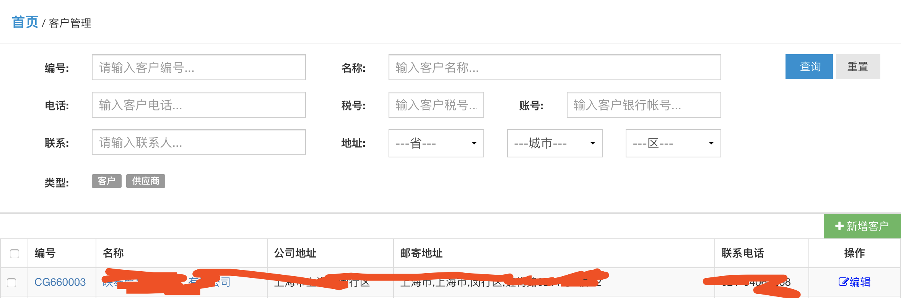
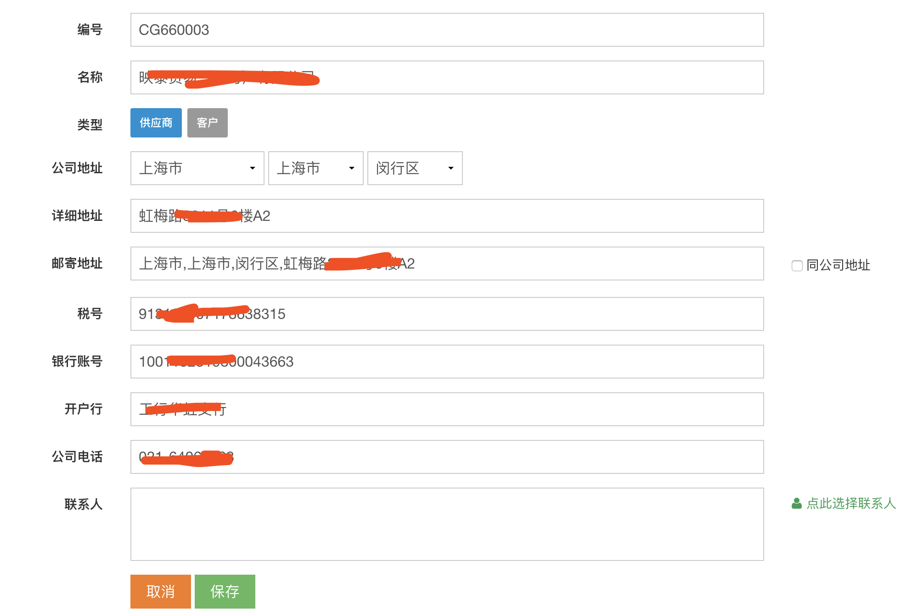
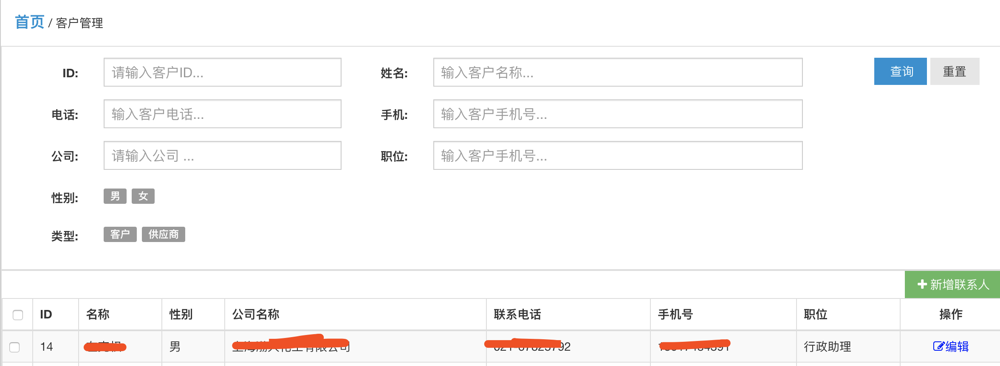
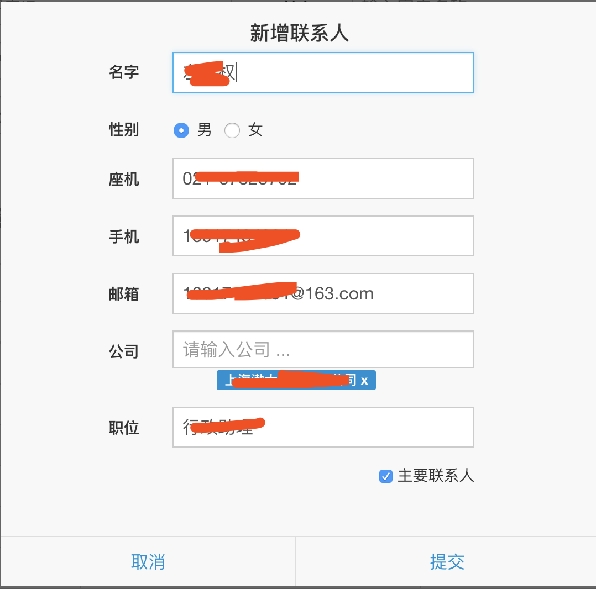

客户管理
======================
## 1 简介
客户资源在企业中包含客户、供应商两类。 客户资源一般是企业，同时企业联系人是企业的代表。如何管理好客户资源、企业联系人已经成为很多企业发展的重要保证。

## 2 客户查询
http://www.lusochem.com/portal/supliers

1. 客户编号： 根据企业对客户的编号查询
2. 名称： 根据客户公司名称查询（支持模糊查询）
3. 电话： 根据客户公司电话查询（支持模糊查询）
4. 税号： 根据客户公司税号查询（支持模糊查询）
5. 账号： 根据客户公司账号查询（支持模糊查询）
6. 联系： 根据客户公司联系人查询
7. 地址： 根据客户公司地址查询
8. 类型： 根据客户类型查询，比如只查询客户、供应商等

## 3 新增、编辑客户
http://www.lusochem.com/portal/suplier/edit.html

## 4 联系人查询
http://www.lusochem.com/portal/contacts.html

1. ID: 根据联系人ID查询
2. 姓名： 根据联系人姓名查询
3. 电话： 根据联系人电话查询
4. 手机： 根据联系人手机查询
5. 公司： 根据联系人公司查询
6. 职位： 根据联系人公司查询
7. 性别： 根据联系人性别过滤
8. 类型： 根据联系人类型查询，如只查询客户、供应商

## 5 新增、编辑客户

