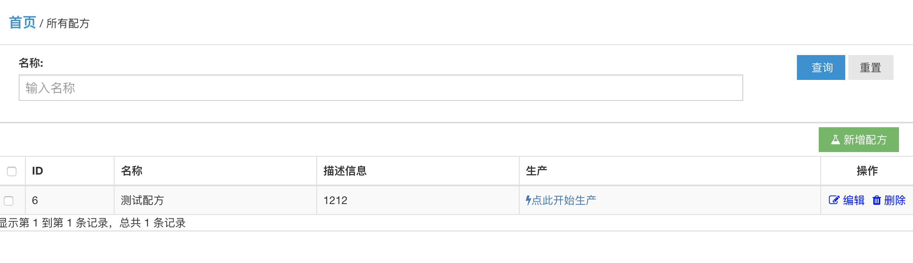
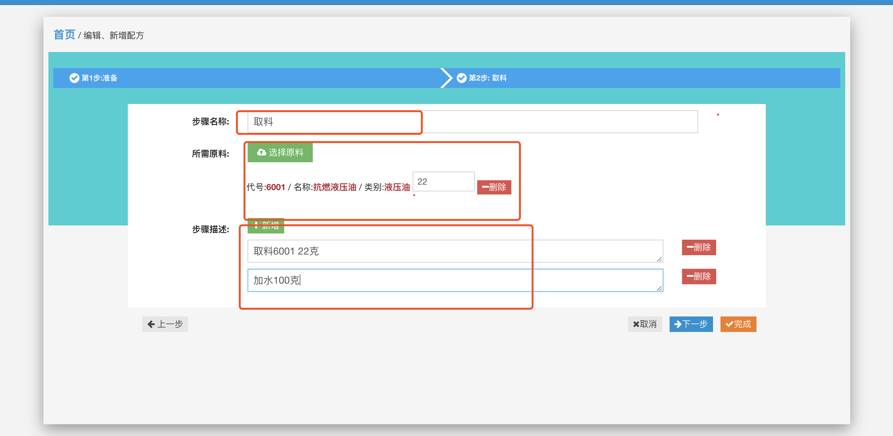
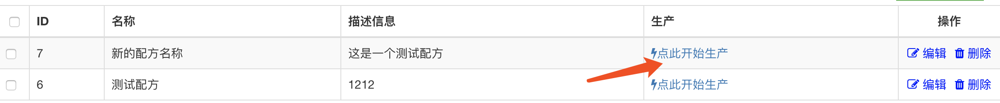

配方研发
========

1 简介
------

配方是指企业生产过程中的参照，涉及配料情况以及生产工艺。如何研发新的配方以及完善配方成为企业赖以生存的重要保证。

2 配方查询
----------

|配方查询| 1. 查询： 当前支持按照配方名称过滤查询 2. 查询结果：
根据过滤条件查询到的配方列表 3. 操作区域：
有权限的配方研发人员可以通过操作区 “开始新的配方”。 从而生成新的配方

3 新建编辑配方
--------------

|配方研发| 通过操作区域 开始新的配方或者编辑配方操作，
可以以向导的方式维护配方。 每一步包括以下字段： 1.
步骤名称，提示本步骤的主要作用 2. 原料列表，本步骤需要的原料 3.
步骤描述，本步骤的操作工艺描述，请详细注明操作步骤以方便生产人员参照。

4 配方投产
----------

新的配方配置完成后会在查询结果区域显示，生产人员可以在列表操作区点击“开始生产”
|开始生产|

