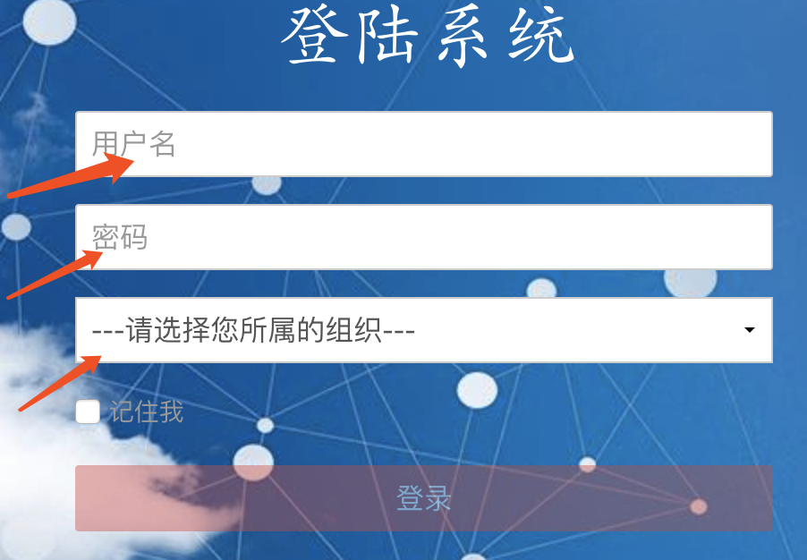

第三：注册、登录
================

1 注册
------

当前不提供自助注册用户功能，需要用户提供登录用户名以及组织信息给后台管理员。

联系方式： https://luso.readthedocs.io/zh_CN/latest/luso_erp.html#id3

2 登录
------

默认无登录状态，全部功能不可用。
访问任何业务逻辑都会重定向到登录页面。http://www.lusochem.com/portal/admin/login

1. 用户名： 登录系统的用户名，注册请参照上文
2. 密码： 密码
3. 组织： 系统根据用户名自动选取所属的组织，需选择。

   2
