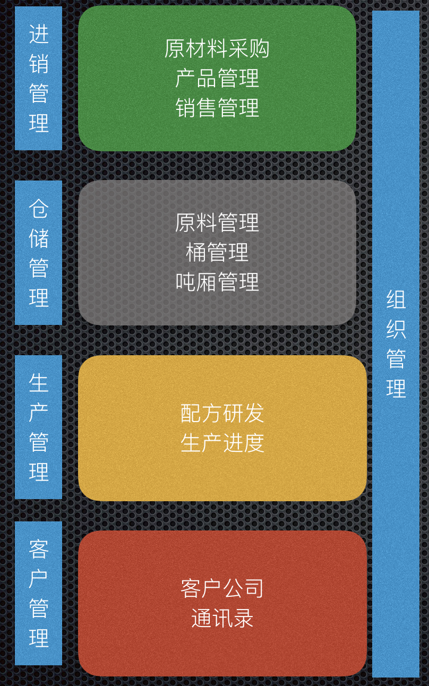

# 第二：路索ERP系统
===================

1. 链接： http://www.lusochem.com/portal/index.html
2. 测试账号：

   -  用户名：syf
   -  密码：1
   -  组织：测试公司

1 简介
------

   st1.001

1.1 设计宗旨
~~~~~~~~~~~~

以企业为组织管理单元。对企业日常管理进行抽象，划分出5个系统即：组织管理系统、进销管理系统、仓储系统、生产系统、客户系统。
组织之间资源分离保证了良好的安全性。

1.2 产品特色
~~~~~~~~~~~~

1. 以企业资源为核心。对采购、存储、生产、销售进行一体化管理。管理者可以对企业当前的运行进行宏观的掌握。
2. 以企业运维为目标。

   -  流程化管理企业采购事物，很大程度上避免采购盲目话、浪费现象。
   -  对企业库存进行日报话管理，无论企业运维人员、管理人员都能及时获取企业库存的现状。
   -  生产流程化，生产单、生产工艺、产品入库。保证了不同层次的生产人员能更好的完成生产工艺。从而有效的避免了生产事件。
   -  多维度客户资源查询，保障公司客户资源的共享

3. 以保密、权限为保障： 企业资源完全隔离，仅对本企业账号可见；
   同一企业的不同用户权限也有严格的界限，即对正确的人开放正确的管理权限。

2 谁可以使用?
-------------

中小型生产企业。如果您的企业存在以下正待解决的问题。
您可以及时与我们取得联系试用。 > 1.
主要通过人工、Excel表格的方式管理企业资源 > 2.
企业资源共享还是依靠邮件发送附件 > 3. 企业资源共享过程中可能泄密

3 联系我们
----------

1. 版权公司： 路索化学技术有限公司。
2. 联系人： 申元功
3. 电话： 18621276983
4. 邮箱地址： ygshen2006@163.com
