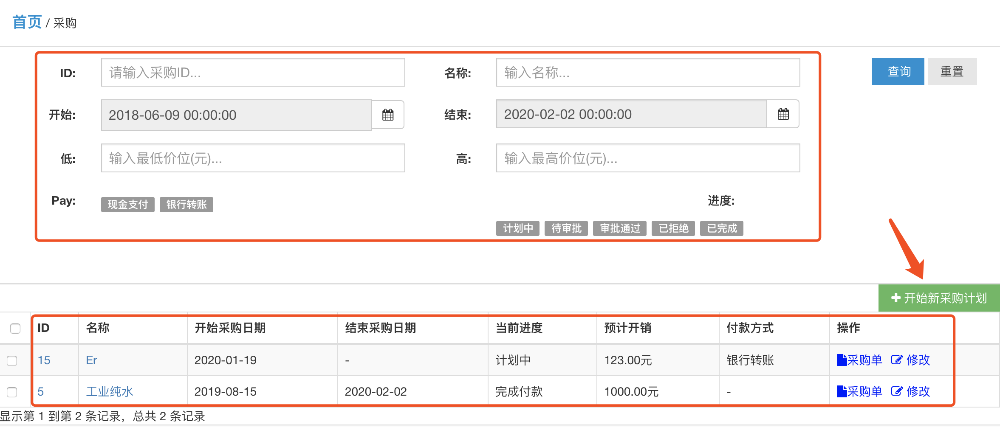
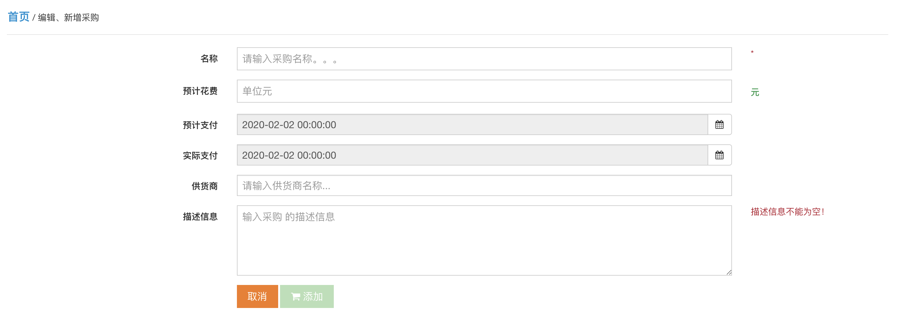
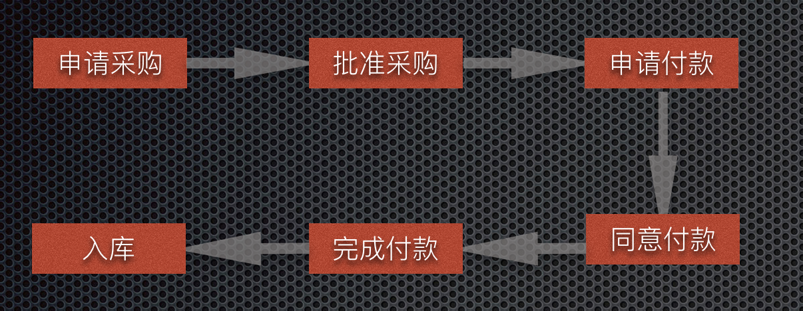
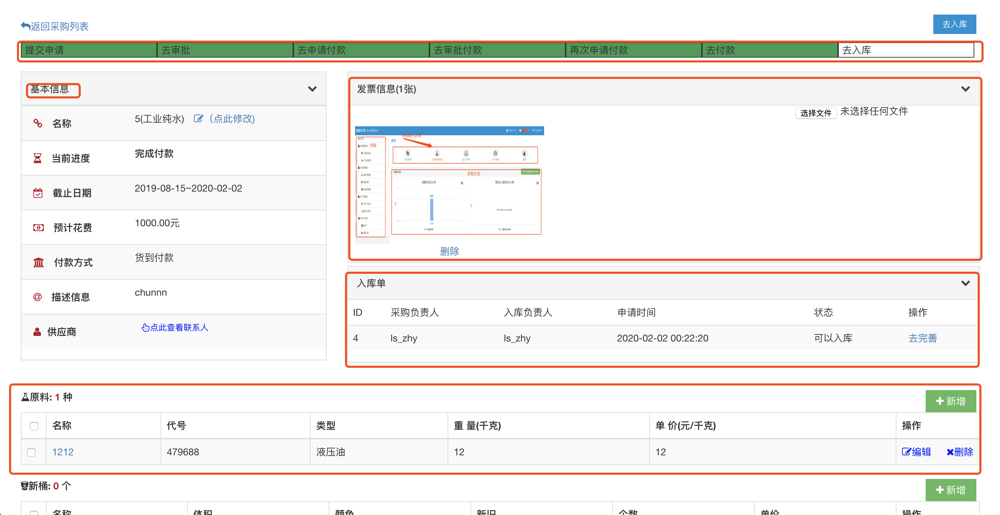

第五：采购系统简介
======================
## 1 简介
采购系统是企业库存原料的入口，如何有效的规划、追踪采购已经成为企业重要的工作。

## 2 采购查询
1. 链接：http://www.lusochem.com/portal/purchases
2. 查询条件：

      - ID：采购ID
      - 名称：采购名称，提供模糊查询机制
      - 开始： 开始采购时间
      - 结束： 结束采购时间
      - 低： 最低价格
      - 高： 最高价格
      - Pay： 付款方式
      - 进度： 状态  
3. 查询结果： 符合条件的采购列表， 默认返回当前组织的所有采购。

## 3 新建采购
采购人员发起一次新的采购前可以通过如图所示开启新的采购计划。

1. 名称： 为了便于后续查找和统计，请给每次采购起一个名字。 比如： 采购xxx
2. 预计花费： 预计本次采购总共话费金额
3. 预计支付日期
4. 实际支付日期
5. 供货商
6. 描述信息： 本次采购的描述信息，为了便于回忆本次采购任务，请填写详细的描述信息

## 4 采购详情
新的采购开始后，就可以在采购列表中根据采购信息查询到了。进入每条采购记录后，系统从以下几点对其生命周期、详情等进行了详尽的描述：

1. 采购过程： 本ERP系统将采购过程划分为如下几个子过程，每个过程的推进都需要相关负责人审核。
2. 基本信息： 描述本次采购的基本信息。
3. 发票信息: 采购完成入库之前采购人员需上传发票以供日后查询
4. 入库单： 入库单是入库之前必须完善的信息，主要是给库存保管人员参照入库的凭证。
5. 采购详情： 本次采购的内容，比如采购了哪些油品、新桶、新顿箱等。

