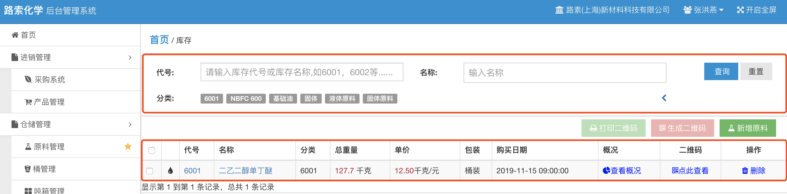
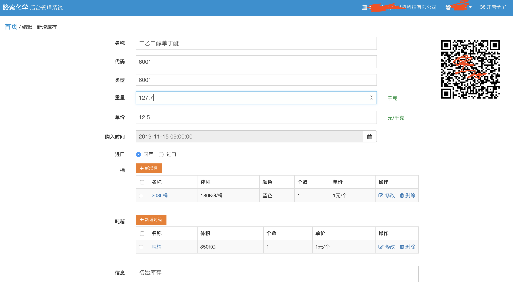

库存管理
======================

## 1 简介
库存是企业采购物资的仓库，对于化学生产型企业库存分为：油品、桶、吨箱等。

系统从3方面维护企业资源的动态平衡。采购入库、企业资产清算、生产消耗。

1. 企业资产清算： 企业通常会定期清算库存资源，在清算过程中会涉及企业资源的增删改。或者企业新接入系统前也会对现有物资进行梳理，梳理过程中也会涉及企业资源的增删改。
2. 采购入库： 采购阶段新物资入库，会增加物资的库存。
3. 生产消耗： 企业资产不是固定不变或只增不减，在生产过程中企业的资源会被消耗减少。

通过以上3个过程，企业的资源就好比成为一个优良的生态系统。企业管理者也能随时根据库存情况对企业未来的业务有更加清晰的规划、部署。

## 2 库存查询
http://www.lusochem.com/portal/repositories

1. 查询区域： 
    - 代号（企业内部使用的产品代号）
    - 名称：库存名称，支持模糊查询
    - 分类：库存种类，指库存型号或学名等。如抗燃液压油、甘油等
2. 查询结果： 根据查询条件过滤得到的库存列表。 
3. 操作区域： 有权限的用户可以在此处新增库存、生成库存二维码、打印库存二维码。

## 3 新建、编辑库存
此过程也成为建仓。企业完成线下库存梳理后需要将现有库存迁移到系统中。用户可以通过以上操作区域的“新增原料”的方式增加新的库存原料。

http://www.lusochem.com/portal/repository/edit

1. 名称： 原料的名称
2. 代码： 企业内部原材料代码
3. 类型： 原料类型，如果是已有原料类型可以下拉选择。如果是新的原料类型请输入原料类型。
4. 重量： 原料重量，单位千克
5. 单价： 预估单价
6. 购入时间： 原料第一次购入时间
7. 进口： 原料是否为进口
8. 桶： 当前原料的容器。如果是桶装此处请新增桶的规格
9. 顿箱： 类似桶，如果是顿箱装。此处请新增顿箱的规格
10. 信息： 原料的描述信息。
11. 右上角原料二维码： 原料的唯一标示，用户可以通过手机扫描二维码获取原料的基本信息，历史采购信息等。

注意： 除非是已有原料的入库，原料信息通常不需要手动输入。 新的原料一般在采购入库完成后自动生成。
